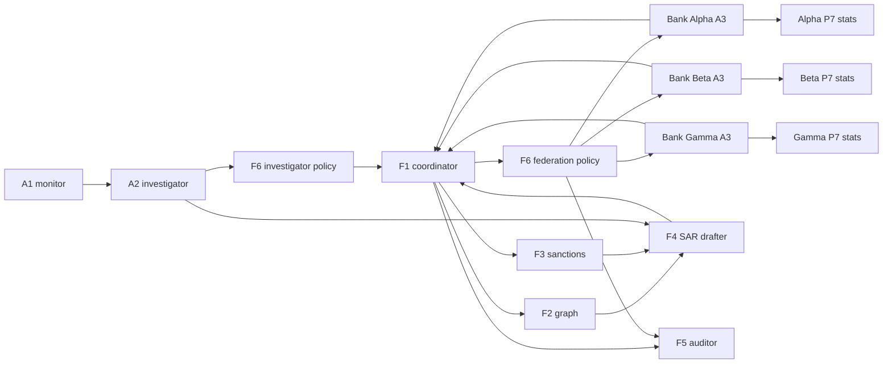

# Agent Notes

This file is the shared coordination scratchpad for parallel Codex, Claude, and
other coding agents working in this repository.

Every agent should leave notes here for the other agents before stopping work,
especially when they changed assumptions, found a blocker, touched a shared
contract, or left a branch in a partial state.

`plan.md` remains the durable source of truth for architecture, milestones,
contracts, acceptance criteria, and demo scope. Use this file for operational
handoff: current ownership, branch status, what changed today, what not to edit
without coordination, and what the next agent should know.

## How To Leave Notes

Add entries under the relevant workstream using this format:

```md
### YYYY-MM-DD - agent/name - branch-name
Status: in_progress | blocked | ready_for_review | done
Touched files:
- path/to/file.py

What changed:
- Short factual summary.

Assumptions:
- Any assumption another agent should not have to rediscover.

Blockers:
- None, or the specific decision/tool/test needed.

Next agent:
- Concrete next action.
```

Keep notes brief. If a decision changes architecture or milestone scope, update
`plan.md` or an ADR under `docs/architecture/` as well, then link it here.

## Current Shared Contract

Branch `short-contract` adds the P10a shared contract pass. These contracts
exist so implementation work can proceed in parallel without each worker
inventing incompatible schemas.

Durable references:
- `plan.md`, especially P10a through P15
- `shared/enums.py`
- `shared/messages.py`
- `tests/test_short_contracts.py`
- `docs/architecture/0001-short-contract-pass.md`

Contract summary:
- F4 consumes `SARAssemblyRequest` and can emit `SARContributionRequest`.
- F5 consumes `AuditReviewRequest` and emits `AuditReviewResult`.
- F6 is a signed per-domain policy actor. It consumes `PolicyEvaluationRequest`
  and emits `PolicyEvaluationResult`.
- F6 policy outputs use `PolicyRuleHit`, `PolicyDecision`,
  `PolicySeverity`, and `PolicyContentChannel`.
- Cross-node F4, F5, and F6 traffic should use the signed message envelope.
- F6 must not mutate signing, replay, route approvals, DP ledgers, or A3
  primitive decisions.

## Per-Agent Build Conventions

These conventions are how F1, A2, A3, and F3 were built. New agents should follow the same shape so the codebase stays consistent and so PRs converge faster.

### LLM-vs-deterministic decision

Every agent is one of three modes; this is the single biggest design decision shaping the implementation. State the chosen mode in the agent's class docstring and in the workstream Notes section below.

- **Deterministic**: no LLM call at runtime; result is computed from inputs + local state.
- **LLM-driven**: every turn calls the LLM with the agent's system prompt + structured-output schema.
- **Hybrid**: deterministic preprocessing or postprocessing wraps an LLM core.

The choice shapes:

- Test design (deterministic agents get golden-output tests; LLM agents use `stub_mode=True` + contract tests).
- Cost / latency (LLM turns add ~30-60s; deterministic turns are ms).
- Auditability (deterministic agents are reproducible; LLM agents need `temperature=0` + recorded outputs).
- Failure modes (deterministic agents fail on bad inputs; LLM agents also fail on bad outputs).

Default expectations:

| Agent | Mode | Reasoning |
|---|---|---|
| A1 monitor | Deterministic | Built. Rule-based pattern matching on transactions. |
| A2 investigator | LLM-driven | Built. Triage is judgment over alert context. |
| A3 silo responder | Deterministic | Built. P7 stats primitives are exact computations. |
| F1 coordinator | LLM-driven | Built. Route planning needs reasoning over query shapes. |
| F3 sanctions | Deterministic | Built. Binary hash lookup; LLM here would be a list-content leak risk. |
| F2 graph | **Hybrid** | Deterministic community detection feeds an LLM classifier. |
| F4 SAR drafter | **LLM-driven** | Narrative synthesis; deterministic mandatory-field gate. |
| F5 auditor | **Hybrid** | Rate-limit checks deterministic; anomaly judgment LLM. |
| F6 policy | **Mostly deterministic** | Audit-critical and must be reproducible; LLM only for adjudication rules. |

### Test commands

Focused tests for one agent before handoff:

```bash
uv run pytest tests/test_<agent>.py -q
```

Full backend suite plus frontend build before opening a PR:

```bash
uv run pytest -q
cd frontend && npm run build
```

### Local code-review harness

After coding a workstream, each agent should commit its work, push its branch,
and open a PR from that branch. Then run the local code-review harness against
the PR branch and keep fixing accepted findings until the review reports no
issues or only cosmetic/stylistic issues that the agent explicitly declines.
Commit and push each accepted-fix round back to the same PR branch.

```bash
uv run --project /path/to/local-gemini-code-review \
  /path/to/local-gemini-code-review/review.py --base origin/main
```

Harness fork: <https://github.com/Airwhale/local-gemini-code-review>. The runbook at [`docs/llm-code-review-runbook.md`](https://github.com/Airwhale/local-gemini-code-review/blob/main/docs/llm-code-review-runbook.md) within the fork documents the iteration loop, accept / decline heuristics, the decline-comment contract, and known gotchas. Use the default Gemini path unless the agent has a clear reason to use a different configured provider/model.

For whole-codebase review (e.g. before P15 lands, or for periodic audits):

```bash
uv run review.py --codebase --include 'backend/**/*.py'
```

### Branch / PR / merge process

1. Branch off `short-contract` for P11-P15 parallel work, unless `plan.md` says a later base is required.
2. Implement; run focused tests + the frontend build if you touched anything frontend-adjacent.
3. Commit and push the implementation branch; open a PR from that branch.
4. Run the local code-review harness. Fix accepted CRITICAL/HIGH/MEDIUM correctness, security, privacy, concurrency, schema, and test findings. Commit and push each accepted-fix round.
5. Stop when the harness reports no issues or only cosmetic/stylistic findings that are explicitly declined with a note or code comment.
6. (Optional, recommended on high-risk surfaces) Call `/gemini review` on the PR for an independent final-mile verification.
7. Merge requires explicit human approval. Match prior PRs' merge-commit style. Delete the branch after merge.

### UI integration triple

Each new built component needs all of these UI touches as part of its workstream (F3 set the template):

1. **`ComponentId` enum entry** in `backend/ui/snapshots.py` — confirm it exists (most are pre-declared).
2. **Component-snapshot branch** in `state.component_snapshot()` surfacing operational state. The branch MUST NOT leak protected internal state (e.g. F3 surfaces `watchlist_size` but never `watchlist_contents`).
3. **Inspector panel**: if the snapshot has unique structure, add a panel under `frontend/src/components/inspector/`. If snapshot is just status + fields, the existing `GenericFieldsPanel` handles it (preferred default — fewer files).
4. **UI test**: status-row assertion in `tests/test_ui_api.py::test_create_session_returns_typed_component_readiness`, and (if you added a snapshot branch) an end-to-end snapshot endpoint test asserting the surfaced fields plus negative checks for protected fields.

### Audit emission pattern

Each agent emits `AgentAuditEvent` records via the base class's `_emit()` helper. Conventions:

- `kind=BYPASS_TRIGGERED` when a deterministic rule short-circuited an LLM path
- `kind=MESSAGE_SENT` for the agent's outbound message
- `kind=CONSTRAINT_VIOLATION` when input validation rejected a message
- `rule_name` / `bypass_name` use the form `<AgentID>-B<N>` (e.g. `F3-B1`, `F1-B2`)
- `model_name="deterministic_<descriptor>"` for non-LLM paths; the actual model slug for LLM paths

### Fixtures available

All workstreams can rely on the data fixtures pre-staged by `data/scripts/plant_scenarios.py`:

- **S1**: 5-entity structuring ring spanning all 3 banks; S1-D is the planted PEP hash (`9ca42fcf00e1dea0` in `data/mock_sdn_list.json`).
- **S2**: 3-entity ring spanning Bank Alpha + Bank Beta only.
- **S3**: layering chain through all 3 banks.

Each scenario lives in the bank SQLite DBs at `data/silos/<bank>.db`. The fixture-customer-name list (`_PLANTED_ENTITY_NAMES` in `tests/test_messages.py`) is the canonical "you must not let these strings leak" regression fixture.

## Coordination Rules

- Leave a note in this file at the end of each work session.
- Treat `plan.md` as the source of truth. This file can summarize it, not
  replace it.
- Do not independently change `shared/messages.py`, `shared/enums.py`,
  `backend/ui/snapshots.py`, or public API shapes without leaving a note and
  running focused contract tests.
- If a contract mismatch is discovered, stop broad implementation, write the
  mismatch here, update the contract in one place, and add/adjust tests.
- Keep parallel branches scoped to disjoint write areas when possible.
- Run focused tests for the touched component before handoff.
- Run the local Gemini review harness before final handoff on security,
  privacy, signing, replay, DP, policy, or shared-contract changes.

## System Map



Diagram notes:
- F6 exists per trust domain. The diagram shows investigator and federation
  instances only to keep the graph readable. Bank silo F6 instances should be
  present beside each A3 in the deployment model.
- F5 observes signed audit artifacts and emits findings. It does not mutate
  runtime decisions.
- F4 writes SAR drafts or requests missing SAR inputs through F1. It should not
  contact bank A2 instances directly.

## Workstreams

### P11 - F2 Graph Analysis

Owner:
Branch:
Status: not_started
Mode: hybrid (deterministic graph statistics feeding an LLM pattern classifier)
Fixtures: S1 ring (canonical positive), S2 ring (Alpha+Beta only), S3 layering chain (positive); legitimate-business-only sessions (negative). Use `data/scripts/plant_scenarios.py` outputs.

Goal:
- Build the F2 graph-analysis agent that consumes DP-noised aggregate patterns
  and emits graph-pattern classifications.

Inputs:
- `GraphPatternRequest`
- `BankAggregate` values produced by P7 through A3/F1
- No raw transactions
- No raw customer names

Outputs:
- `GraphPatternResponse`
- `pattern_class`
- `confidence`
- `suspect_entity_hashes`
- hash-only narrative

Expected files:
- `backend/agents/f2_graph_analysis.py`
- `backend/agents/prompts/f2_system.md`
- optional typology helper module
- `tests/test_f2.py`

Do not touch without coordination:
- `shared/messages.py`
- `shared/enums.py`
- F1 route-planning internals, unless a real P11 handoff mismatch is found

Acceptance:
- Detect planted structuring ring.
- Detect layering-chain fixture.
- Return `none` or low confidence for noise.
- Preserve hash-only output.
- Pass focused F2 tests and existing shared-message tests.

Notes:

### P12 - F4 SAR Drafter

Owner:
Branch:
Status: not_started
Mode: LLM-driven (narrative synthesis) with a deterministic mandatory-field gate
Fixtures: A2 `SARContribution` outputs from a canonical run; F3 sanctions hit on S1-D PEP fixture; F2 `GraphPatternResponse` on S1 ring. Construct in the test setup until P15's canonical-run integration test makes real ones available.

Goal:
- Build the F4 SAR drafter that turns validated investigation artifacts into a
  structured SAR draft or a typed request for missing input.

Inputs:
- `SARAssemblyRequest`
- `SARContribution` records from A2, bundled by F1/orchestrator
- optional `GraphPatternResponse`
- optional `SanctionsCheckResponse`
- optional `PolicyEvaluationResult` records

Outputs:
- `SARDraft`
- `SARContributionRequest` when mandatory fields are missing

Expected files:
- `backend/agents/f4_sar_drafter.py`
- `backend/agents/prompts/f4_system.md`
- optional SAR helper/template module
- `tests/test_f4.py`

Do not touch without coordination:
- `SARAssemblyRequest`
- `SARContributionRequest`
- `SARDraft`
- customer-name redaction helpers

Acceptance:
- SAR draft includes mandatory structured fields.
- High priority is forced when sanctions or PEP evidence exists.
- Missing mandatory inputs produce `SARContributionRequest`.
- Narrative references Section 314(b) authority and uses bank IDs and hashes,
  not customer names.

Notes:

### P13 - F5 Compliance Auditor

Owner:
Branch:
Status: not_started
Mode: hybrid (deterministic rate-limit / authorization checks; LLM anomaly judgment over event traces)
Fixtures: signed audit-event traces from a canonical run; injected over-quota traces (one actor exceeds 5 queries/min); injected unauthorized-actor traces (A1 attempting cross-bank query). Construct in test setup.

Goal:
- Build the F5 compliance auditor over signed audit artifacts.

Inputs:
- `AuditReviewRequest`
- `AuditEvent` list
- optional `DismissalRationale` list
- related query IDs

Outputs:
- `AuditReviewResult`
- `ComplianceFinding` records
- `human_review_required`
- `rate_limit_triggered`

Expected files:
- `backend/agents/f5_compliance_auditor.py`
- `backend/agents/prompts/f5_system.md`
- `tests/test_f5.py`

Do not touch without coordination:
- `AuditEvent`
- `AuditReviewRequest`
- `AuditReviewResult`
- audit payload unions

Acceptance:
- Rate-limit finding requires `kind="rate_limit"`.
- High or critical findings force `human_review_required=True`.
- Normal canonical flow does not over-flag.
- F5 remains read-only and cannot block or rewrite runtime behavior.

Notes:

### P14 - F6 Policy Adapter And Lobster Trap Overlay

Owner:
Branch:
Status: not_started
Mode: mostly deterministic (rule evaluation); LLM only for explicit adjudication rules where the rule itself names a model
Fixtures: prompt-injection payloads, customer-name-leakage attempts, private-data-extraction probes, route-metadata violations. Pre-existing `tests/test_p0_cases.py` payloads cover P0 / smoke; P14 adds AML-specific fixtures under `tests/test_aml_policy.py`.
Per-domain instantiation: F6 instances are registered in `_build_demo_principals()` in `backend/ui/state.py` — each trust domain gets its own signing key pair. The orchestrator (P15) routes `PolicyEvaluationRequest` to the per-domain F6 by `(role=F6, trust_domain=<sender's domain>)` lookup; see `docs/architecture/0002-orchestrator-design.md` for the AgentRegistry shape.

Goal:
- Build the Python AML policy adapter and local Lobster Trap integration behind
  the F6 policy actor contract.

Inputs:
- `PolicyEvaluationRequest`
- signed message metadata
- safe content summaries and content hashes
- Lobster Trap verdicts
- AML routing/redaction dictionaries

Outputs:
- `PolicyEvaluationResult`
- `PolicyRuleHit` records
- normalized `AuditEvent` records for policy decisions

Expected files:
- `backend/policy/`
- `infra/lobstertrap/aml_overlay_policy.yaml` if verified against local LT
- `tests/test_aml_policy.py`

Do not touch without coordination:
- signing helpers
- replay cache internals
- DP ledger internals
- A3 primitive enforcement

Acceptance:
- Prompt injection, customer-name leakage, private-data extraction, and route
  metadata violations produce typed policy decisions.
- Top-level `PolicyEvaluationResult.decision` matches the strongest rule hit.
- Redaction counts match redacted fields in rule hits.
- No private keys, API keys, raw names, or raw account IDs appear in policy
  output or audit records.

Notes:

### P15 - Orchestrator, Message Bus, And Live API Adapters

Owner:
Branch:
Status: not_started
Mode: orchestration only — this layer does not call the LLM directly. Agents are LLM-driven or deterministic per their own definitions; the orchestrator just routes messages between them.

Detailed design lives in [`docs/architecture/0002-orchestrator-design.md`](docs/architecture/0002-orchestrator-design.md). Read that ADR first — it covers turn semantics, message-bus shape, concurrency model, the state machine, probe compatibility, the live API adapter pattern, file layout, implementation order, and the risks the P15 implementer needs to plan around. The acceptance criteria below are the canonical short form; the ADR is the full operational brief.

Acceptance:
- Canonical run proceeds through A1/A2/F1/A3/P7/F3/F2/F4/F5/F6.
- Each cross-boundary message verifies signature, freshness, replay, and route
  binding where applicable.
- UI snapshots show live state, not placeholder state, for built components.
- Probe traffic still enters through normal security and policy boundaries.

Do not touch without coordination:
- public API response shapes
- frontend generated schema
- shared message contracts

Notes:

### P18 - Judge Console Polish

Owner:
Branch:
Status: not_started

Goal:
- Polish the existing P9b console into the final judge-facing demo surface.

Inputs:
- P9a/P15 API snapshots
- live timeline events
- attack/probe results
- model route metadata
- policy, DP, signing, replay, route approval, and audit state

Outputs:
- browser UI views
- inspector panels
- attack lab controls
- demo-ready state displays

Expected files:
- `frontend/src/`
- generated API schema after backend API changes
- UI-focused tests or smoke checks

Do not touch without coordination:
- backend API contracts unless a UI-blocking gap is found
- shared message contracts

Acceptance:
- Judges can inspect every trust domain and built component.
- Not-built components are clearly labeled.
- Inputs and outputs have brief explanatory text.
- Attack lab can target relevant nodes without privileged bypasses.

Notes:

## Shared Contract Change Log

### 2026-05-15 - Codex - short-contract
Status: in_progress
Touched files:
- `shared/enums.py`
- `shared/messages.py`
- `shared/__init__.py`
- `tests/test_short_contracts.py`
- `docs/architecture/0001-short-contract-pass.md`
- `README.md`
- `plan.md`
- `AGENT_NOTES.md`

What changed:
- Added P10a contracts for F4, F5, and F6.
- Added ADR for the short contract pass.
- Added this shared notes file for parallel worker coordination.

Assumptions:
- `plan.md` remains the durable plan.
- This file is a coordination scratchpad.
- F6 is per trust domain and signed, but not a business-reasoning agent.

Blockers:
- None known.

Next agent:
- Pick a single workstream above, fill in Owner and Branch, then leave a note
  before stopping.

### 2026-05-15 - Claude - docs/agent-notes-expansion
Status: ready_for_review
Touched files:
- `AGENT_NOTES.md`
- `docs/architecture/0002-orchestrator-design.md` (new)

What changed:
- Added Per-Agent Build Conventions section: LLM-vs-deterministic mode
  table for every built and unbuilt agent, focused-test command shape,
  full-suite + frontend-build command shape, local-code-review-harness
  invocation with link to the runbook, branch / PR / merge process,
  UI-integration triple checklist, audit-emission convention summary,
  and a Fixtures-available section pointing at S1/S2/S3 scenarios.
- Added per-workstream Mode + Fixtures lines to P11 / P12 / P13 / P14
  so the implementer doesn't re-litigate the LLM-vs-deterministic
  split or hunt for test fixtures.
- Trimmed P15 to a one-paragraph pointer at the new ADR; full design
  (turn semantics, message bus, concurrency, state machine, probe
  compatibility, file layout, implementation order, risks) lives in
  ADR 0002.

Assumptions:
- The mode assignments in the Per-Agent Conventions table are
  defensible defaults, not mandates -- workstream owners can deviate
  if they document the reason in their Notes section.
- The orchestrator ADR is "proposed"; the P15 implementer marks it
  Accepted once they've validated the design fits the live wiring
  reality. Anything they disagree with should produce an ADR
  amendment, not a silent deviation.

Blockers:
- None.

Next agent:
- A workstream owner (P11 / P12 / P13 / P14 / P15) can pick up their
  block, fill in Owner and Branch, and follow the conventions to
  ship.
