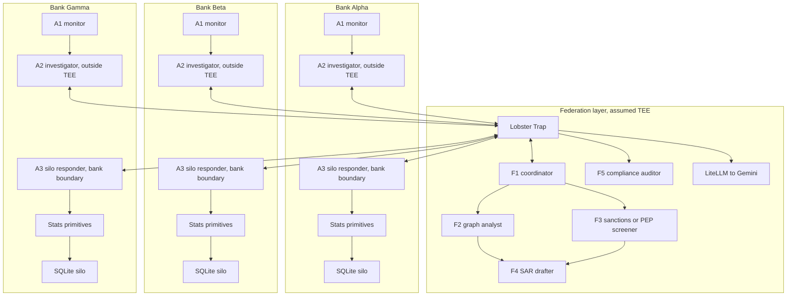

# federated_silo_agent

**Multi-agent cross-bank AML investigation system with privacy-preserving federation.**

Three synthetic banks each run a transaction-monitoring agent, an outside-TEE investigator agent, and an inside-bank silo responder agent. When suspicious activity surfaces at one bank, the investigator agent asks the federation coordinator to query peer banks. Peer-bank evidence is answered by each bank's silo responder inside that bank's trusted boundary, using deterministic stats primitives rather than exposing raw data to the investigator. Specialist federation agents coordinate graph analysis, sanctions or PEP screening, SAR drafting, and compliance audit. **Every cross-bank conversation is policed by Veea Lobster Trap plus an AML policy adapter. Banks share hash-based entity tokens rather than customer identities; aggregate-count queries are protected by differential privacy where it applies. No customer data crosses bank boundaries.**

Built for the [TechEx Intelligent Enterprise Solutions Hackathon](https://lablab.ai/ai-hackathons/techex-intelligent-enterprise-solutions-hackathon), May 11 to 19, 2026. Primary submission track: **Track 4, Data & Intelligence**. Partner-award strategy: **Gemini** powers the LLM agents through Google services; **Veea Lobster Trap** is the policy substrate. Pitch comp: **Verafin to Nasdaq, $2.75B in 2020** for the non-private version of this market.

> **Pivot note:** this project pivoted from clinical federated stats to cross-bank AML on May 12, 2026. The prior clinical work is preserved in [`docs/clinical-archive/`](docs/clinical-archive/) and [`data/scripts/clinical-archive/`](data/scripts/clinical-archive/). The active build is AML.

## What This Is

A multi-agent federated AML investigation platform:

1. **8 agent roles, 14 running agent instances.** Three A1 transaction-monitoring instances, three outside-TEE A2 investigator instances, three inside-bank A3 silo responder instances, and five federation roles: F1 coordinator, F2 graph analyst, F3 sanctions or PEP screener, F4 SAR drafter, and F5 compliance auditor.
2. **Lobster Trap polices inter-agent messages.** The P0 policy already blocks prompt injection, jailbreaks, obfuscation, private-data extraction, data exfiltration, dangerous commands, and sensitive path access. The AML-specific policy pack comes later in P14.
3. **Privacy enforcement is layered.** Hash-based entity linkage is the primary cross-bank correlation mechanism. A2 has no raw database or stats-primitive handle. A3 invokes deterministic stats primitives inside each bank boundary. Schema validation limits what can leave a silo. Differential privacy applies to aggregate-count and histogram-style primitives where it provides useful protection.

The demo scenario is a planted structuring ring spanning Bank Alpha, Bank Beta, and Bank Gamma. Each entity holds accounts at two banks. Per-bank activity stays noisy and sub-threshold; the pooled cross-bank pattern reveals the ring. One entity has a synthetic PEP relation for the sanctions agent to flag.

## Why It Matters

Section 314(b) of the USA PATRIOT Act allows financial institutions to share information about suspected money laundering and terrorist financing. In practice, banks underuse it because the operational and legal process is slow, inconsistent, and uncomfortable for competing institutions.

This project does not remove legal review. It lowers the technical friction:

- Common query primitives instead of ad hoc requests
- Hash-based cross-bank linkage instead of customer-name sharing
- Policy enforcement and audit logs for every cross-bank message
- Differential privacy budgets for repeated aggregate queries
- A reproducible multi-agent demo that shows why federation detects what a single bank misses

## Workflow

The core path is deliberately not a single headless model call:

```text
User or analyst
  -> A2 outside-TEE investigator
  -> Lobster Trap + AML policy adapter
  -> F1 federation coordinator in the assumed federation TEE
  -> Lobster Trap + AML policy adapter
  -> peer A3 silo responders inside each bank trusted boundary
  -> P7 stats primitives inside each bank boundary
  -> A3 signed/provenance-backed response
  -> F1 aggregation
  -> A2 synthesis back to the user
```

`A2` is human-facing and decides what to ask. `F1` validates, routes, aggregates, and audits. `A3` independently re-checks purpose, routing, allowed primitive shape, and DP budget before touching local data. The data returned to `A2` is bounded signal: booleans, counts, histograms, hash lists, refusal reasons, and provenance records. Raw transactions and customer names do not return to `A2`.

## Current Build State

| Part | Status | Notes |
|---|---|---|
| P0 | Done | Repo scaffold, LiteLLM config, Lobster Trap build scripts, P0 smoke tests. Lobster Trap and blocked proxy ingress are verified. OpenRouter fallback pass-through is verified; direct Gemini pass-through still needs a valid Gemini key. |
| P1 | Done | Clinical work archived and AML plan established. |
| P2 | Done | Three synthetic bank databases generated with planted AML scenarios. |
| P3 | Done | Data validation and checksum tests pass. |
| P4 | Done | Shared Pydantic v2 message schemas for agent traffic. |
| P5 | Next | Agent runtime base class. |

See [`plan.md`](plan.md) for the full build plan.

## Data

The active AML data lives in [`data/silos/`](data/silos/) after generation:

| Bank | Customers | Accounts | Transactions | Signals | Ground-truth rows |
|---|---:|---:|---:|---:|---:|
| Bank Alpha | 8,009 | 14,043 | 112,212 | 1,969 | 9 |
| Bank Beta | 5,009 | 8,375 | 46,743 | 794 | 9 |
| Bank Gamma | 3,005 | 4,836 | 22,961 | 313 | 5 |

The planted scenarios include:

- S1: 5-entity structuring ring spanning all three banks
- S2: 3-entity structuring ring spanning Alpha and Beta
- S3: 4-entity layering chain across Alpha, Beta, Gamma, and back to Alpha
- S4: PEP marker on the S1-D entity

Regenerate and validate:

```powershell
uv run python data/scripts/build_banks.py
uv run python data/scripts/plant_scenarios.py
uv run python data/scripts/validate_banks.py
uv run pytest tests/test_data_checksum.py
```

## Architecture



Three paths matter:

- **LLM path:** agent to Lobster Trap to LiteLLM to Gemini. This is where natural-language reasoning and structured-output agent calls happen.
- **Coordinator path:** A2 sends approved cross-bank questions only to F1. F1 routes to peer A3 responders and aggregates responses back to A2.
- **Cross-bank response data path:** A3 to stats primitives to local SQLite. This is deterministic and bank-local. A2 has no raw database or P7 stats-primitive handle.

## Privacy Model

| Mechanism | Role |
|---|---|
| Hash-based linkage | Lets banks correlate the same shell entity across institutions without exposing names. |
| Stats primitives | Restrict cross-bank data access to declared query shapes. |
| Schema validation | Blocks raw rows and undeclared shapes from leaving a bank. |
| Lobster Trap | Polices prompt injection, unsafe requests, role abuse, private data leakage, and cross-agent natural-language channels. |
| Differential privacy | Bounds repeated aggregate-query leakage for counts and histograms. |
| Audit stream | Records cross-bank messages, policy verdicts, primitive provenance, and privacy-budget debits. |

DP is intentionally scoped. It is useful for aggregate counts and flow histograms. It is not the right tool for binary entity-presence queries, where noise would destroy the signal; those rely on hash linkage and audit controls.

## Security Envelope

The design assumes a possible man-in-the-middle attacker on inter-agent network paths. Lobster Trap is necessary for content and policy governance, but it is not the cryptographic integrity layer.

Planned message-security controls:

- **mTLS service identity** between A2, F1, A3, Lobster Trap, LiteLLM, and supporting services.
- **Signed message envelopes** over canonical JSON for `Sec314bQuery`, `Sec314bResponse`, SAR contributions, and audit events.
- **Request/response binding** through `message_id`, `query_id`, `in_reply_to`, route approval metadata, and a hash of the exact approved query body.
- **Replay protection** through timestamp, expiration, nonce, and an idempotency cache.
- **Silo-side re-validation** where A3 treats F1 approval as necessary but not sufficient. A3 still checks role, purpose, target bank, query shape, primitive allowlist, and DP budget.
- **Audit hash chain** so deleted or modified audit events are detectable.
- **TEE attestation hook** for deployments that claim the federation layer or silo responder is running inside a specific trusted execution environment.

The practical rule is: F1 may approve and route, but each silo remains sovereign over whether it can answer. A3 can return a refusal such as `invalid_purpose`, `unsupported_query_shape`, `route_violation`, or `budget_exhausted`.

## P0 Proxy Chain

P0 proves the governance path:

```text
agent or smoke script
  -> Lobster Trap on http://127.0.0.1:8080
  -> LiteLLM on http://127.0.0.1:4000
  -> Gemini API
```

Local policy smoke, no Gemini key required:

```powershell
.\scripts\bootstrap_lobstertrap.ps1
uv run python scripts/smoke_lobstertrap.py
```

Full proxy smoke, Gemini key required:

```powershell
$env:GEMINI_API_KEY = "<your key>"
.\scripts\start_litellm.ps1
.\scripts\start_lobstertrap.ps1
uv run python scripts/smoke_proxy.py
```

OpenRouter fallback smoke, OpenRouter key required:

```powershell
$env:OPENROUTER_API_KEY = "<your key>"
.\scripts\start_litellm.ps1 -OpenRouter
.\scripts\start_lobstertrap.ps1
uv run python scripts/smoke_openrouter.py
```

OpenRouter can be used as a development fallback through LiteLLM, but the primary hackathon story should stay direct Gemini via Google AI Studio or Gemini API.

More detail lives in [`docs/p0_proxy_chain.md`](docs/p0_proxy_chain.md).

## Project Structure

```text
federated_silo_agent/
  data/
    silos/                         generated bank SQLite databases
    scripts/
      build_banks.py               baseline synthetic bank generation
      plant_scenarios.py           planted AML rings and layering chain
      validate_banks.py            scenario and data validation
      clinical-archive/            prior clinical pipeline
  docs/
    p0_proxy_chain.md              local P0 runbook
    clinical-archive/              prior clinical plan
  infra/
    litellm_config.yaml            Gemini routing through LiteLLM
    litellm_openrouter_config.yaml OpenRouter fallback routing through LiteLLM
    docker-compose.yml             optional LiteLLM plus Lobster Trap stack
    lobstertrap/
      base_policy.yaml             current P0 policy
      Dockerfile                   optional container build
  scripts/
    bootstrap_lobstertrap.ps1      clone, test, and build Lobster Trap
    start_litellm.ps1              native Windows LiteLLM launcher
    start_lobstertrap.ps1          native Windows Lobster Trap launcher
    smoke_lobstertrap.py           local policy smoke
    smoke_proxy.py                 live proxy-chain smoke
      smoke_openrouter.py            OpenRouter-backed proxy-chain smoke
      p0_cases.py                    shared P0 prompt cases
  shared/
    enums.py                        shared enum values
    messages.py                     Pydantic v2 message contracts
  tests/
    test_data_checksum.py
    test_messages.py
    test_p0_cases.py
  plan.md
  README.md
```

## Setup

Python:

```powershell
uv sync
uv run pytest
```

Gemini:

```powershell
# Create .env manually or set the variable in your shell.
$env:GEMINI_API_KEY = "<your key>"
```

The current shell can also use `OPENROUTER_API_KEY` if the LiteLLM config is switched to the OpenRouter fallback route.

## Verification

Known-good checks:

```powershell
uv run python data/scripts/validate_banks.py
uv run pytest
uv run pytest tests/test_messages.py
uv run python scripts/smoke_lobstertrap.py
```

The live benign Gemini proxy check is intentionally separate because it spends provider quota and requires an API key.

## Acknowledgments

- [Veea Lobster Trap](https://github.com/veeainc/lobstertrap), the policy proxy for LLM-channel governance.
- [Google Gemini](https://ai.google.dev/), the target LLM provider for the hackathon build.
- [LiteLLM](https://github.com/BerriAI/litellm), the OpenAI-compatible routing layer.
- [OpenDP](https://github.com/opendp/opendp), the planned library for differential privacy primitives.
- [Synthea](https://synthetichealth.github.io/synthea/), used in the archived clinical prototype.

## License

TBD, likely MIT to match the open-source stack.
