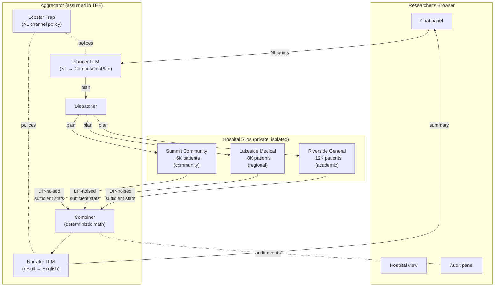
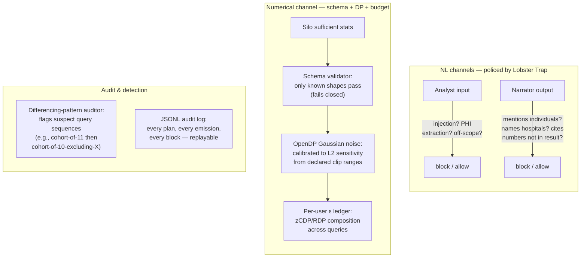
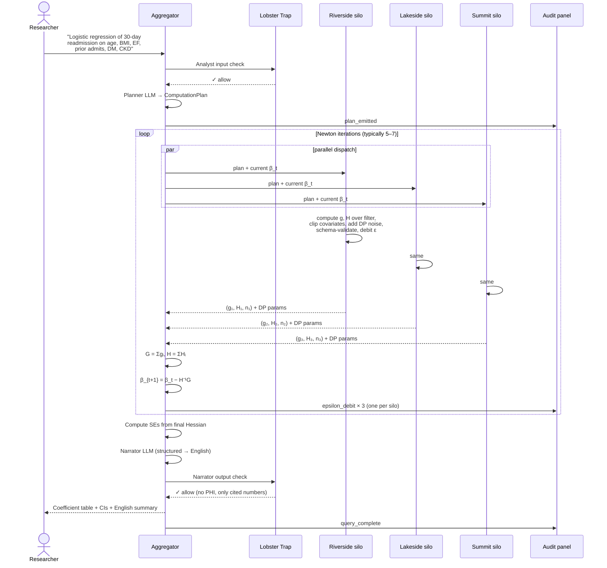

# federated_silo_agent

**Privacy-preserving federated statistics for clinical research, with a natural-language interface.**

Ask a question in English. The system translates it into a structured computation, dispatches sufficient-statistic computations to each hospital silo, applies calibrated differential privacy at every silo egress, sums the results, and narrates the answer back. **No hospital ever sees another's raw data.** Every query is auditable. Privacy budget is visibly bounded across queries.

Built for the [TechEx Intelligent Enterprise Solutions Hackathon](https://lablab.ai/ai-hackathons/techex-intelligent-enterprise-solutions-hackathon) (Veea track), May 11–19, 2026. See [`plan.md`](./plan.md) for the full product design doc and 40-part build plan.

---

## What this is

A federated computation platform for clinical analytics. Three layers, cleanly separated:

1. **Natural-language translation** at the edges. A planner LLM converts the researcher's question into a structured `ComputationPlan`. After the math runs, a narrator LLM converts the numerical result back into English. Both LLM calls are policed by [Veea's Lobster Trap](https://github.com/veeainc/lobstertrap).
2. **Deterministic federated computation** in the middle. Each silo computes only the sufficient statistics required by the plan (`XᵀX`, `Xᵀy`, `n` for OLS; per-iteration gradient + Hessian for logistic; bucket counts for histograms; etc.). The aggregator sums them numerically. No LLM in the math path.
3. **Privacy enforcement at silo egress.** Calibrated Gaussian noise via [OpenDP](https://github.com/opendp/opendp). Per-user privacy budget tracked across queries with composition combinators. Schema validation prevents structural leakage. Differencing-pattern auditor flags adversarial query sequences.

**The demo cohort:** federated outcomes analytics on a Congestive Heart Failure (CHF) study population across three synthetic hospitals (Riverside General, Lakeside Medical, Summit Community Health) using [Synthea](https://synthetichealth.github.io/synthea/)-generated data.

---

## Who it's designed for

| Persona | What they do | What this gives them |
|---|---|---|
| **Outcomes researcher** at a multi-site research network member | Studies clinical questions across hospitals; today blocked by months of IRB / data-use agreement negotiation; rare-cohort studies statistically underpowered at any single site | Cohort histograms, regressions, and survival-adjacent analyses in minutes, with audit trails their IRB would accept |
| **Quality officer / CMIO** | Benchmarks hospital performance on CMS quality measures, Joint Commission accreditation, value-based-care contracts | Real-time peer-benchmark comparisons on equivalent patient populations without uploading any records to a third-party benchmarker |
| **Compliance / Privacy officer** | Reviews data-sharing arrangements for HIPAA readiness | Defensible audit log demonstrating that only DP-noised aggregate statistics — never raw rows — ever left the local environment |

**Not for** clinicians wanting individual case lookups, data scientists wanting raw exports, or single-hospital analytics where federation is overkill.

---

## Project structure

```
federated_silo_agent/
├── frontend/                # Researcher UI (Next.js + Tailwind, or Streamlit fallback)
│   └── app/
│       ├── page.tsx         # Chat panel + result renderer
│       ├── hospitals/       # Per-silo metadata + ε meter
│       └── audit/           # Live SSE feed of all governance events
│
├── backend/
│   ├── main.py              # FastAPI entrypoint
│   ├── aggregator/          # The central coordinator (runs in assumed TEE)
│   │   ├── planner.py       # NL → ComputationPlan (Anthropic structured output)
│   │   ├── dispatcher.py    # Parallel + iterative fan-out to silos
│   │   ├── combine/         # Per-primitive numerical combiners (deterministic)
│   │   └── narrator.py      # Structured result → English summary
│   │
│   ├── silos/               # Per-hospital runtime (one process per silo)
│   │   ├── runner.py        # Generic silo agent
│   │   ├── stats/           # Per-primitive sufficient-statistic computers
│   │   ├── dp.py            # OpenDP Gaussian noise calibration
│   │   ├── budget.py        # Per-user ε ledger via zCDP/RDP composition
│   │   ├── schema.py        # Pydantic egress validator
│   │   └── filter_resolver.py  # Fuzzy NL filter → structured SQL (schema only)
│   │
│   ├── audit/
│   │   ├── tail.py          # Merge Lobster Trap JSONL + DP + schema events
│   │   ├── differencing.py  # Pattern auditor for differencing-attack sequences
│   │   └── api.py           # SSE stream to frontend
│   │
│   └── data/
│       ├── synthea_runner.py     # Orchestrates Synthea generation
│       ├── feature_engineering.py # Cohort features (age_at_index, GDMT, etc.)
│       └── scenarios.py     # Planted demo scenarios (deterministic seed)
│
├── shared/
│   └── plans.py             # Pydantic ComputationPlan + SufficientStats schemas
│                            # (single source of truth, used by aggregator and silos)
│
├── infra/
│   ├── lobstertrap/
│   │   ├── base_policy.yaml          # Universal injection + off-scope rules
│   │   ├── packs/
│   │   │   └── hipaa_pack.yaml       # HIPAA Safe Harbor identifier rules
│   │   └── compose-policy.py         # Merge base + pack → effective policy
│   ├── litellm_config.yaml           # Anthropic ↔ OpenAI shape translation
│   └── docker-compose.yml            # litellm + N×lobstertrap + backend
│
├── tests/                   # pytest suite (equivalence, DP correctness, defense tests)
├── docs/
│   ├── demo_script.md       # Beat-by-beat demo timing
│   └── demo_screencast.mp4  # Live-demo backup
│
├── plan.md                  # Full product design doc + 40-part build plan
└── README.md                # This file
```

---

## Architecture

A researcher's question flows through three trust zones, each policed by a different mechanism.



---

## The statistical pipeline

A single query's lifecycle. **Privacy is paid once, at silo egress (step 5–7).** Combine, finalize, and narrate are post-processing — free under DP closure.

```mermaid
flowchart LR
    Q["NL query"] --> P["1. Plan<br/>(LLM)"]
    P --> D["2. Dispatch<br/>(parallel<br/>or iterative)"]
    D --> LC["3. Local<br/>compute<br/>per silo"]
    LC --> DP["4. DP noise<br/>(calibrated to<br/>sensitivity)"]
    DP --> SV["5. Schema<br/>validate"]
    SV --> BG["6. Budget<br/>debit ε"]
    BG --> EG["7. Egress<br/>(structured JSON)"]
    EG --> CB["8. Combine<br/>(sum across silos)"]
    CB --> FN["9. Finalize<br/>(invert, iterate,<br/>compute SEs)"]
    FN --> NR["10. Narrate<br/>(LLM, policed)"]
    NR --> R["Result<br/>+ audit trail"]
```



For iterative methods (logistic, mixed-effects, Poisson), steps 2–7 repeat per Newton/REML iteration with each iteration debiting its own ε increment from the budget ledger.

---

## Trust mechanisms (defense in depth)

Three orthogonal mechanisms, each doing what it's best at:



**Mapping attacks → defenses:**

| Attack | Defended by |
|---|---|
| Plain-English request for individual records | Lobster Trap (HIPAA Safe Harbor identifier rules) |
| Prompt injection ("ignore previous instructions...") | Lobster Trap (injection patterns) |
| LLM hallucinated numbers in narration | Lobster Trap (narrator egress: only cite structured-result numbers) |
| Compromised silo agent embeds raw rows | Schema validator (fails closed if shape mismatch) |
| Trivially-small cohort (n < k) | Schema validator (k-anonymity floor) |
| Single-query reconstruction / membership inference | DP Gaussian noise calibrated to sensitivity |
| Differencing attack (n vs n−1 cohort) | Differencing-pattern auditor + DP composition makes residual smaller than noise |
| Multi-query inference (repeat to average out noise) | Per-user ε budget exhausts; queries refused |

---

## A query in detail

Here's what happens when a researcher asks for a federated logistic regression — the demo's hero query:



Total ε consumed for this query: ~6 iterations × per-iteration ε = ~0.3 typically (out of a default 1.0 budget per session). The researcher sees the meter tick down per iteration on the audit panel.

---

## Statistical primitives supported

The engine ships with a comprehensive clinical-research toolkit. Every primitive is provably equivalent to centralized computation when DP is off; DP noise is calibrated to the primitive's L2 sensitivity given the plan's declared clip ranges.

### Descriptive

| Primitive | What it produces |
|---|---|
| `count` | Cohort size |
| `mean(x)` | Mean ± SEM |
| `variance(x)` / `stddev(x)` | Pooled variance and standard deviation |
| `proportion(num, den)` | Proportion with Wilson + Clopper-Pearson CIs |
| `quantile(x, q)` | Median, IQR, percentiles, min (`q=0`), max (`q=100`) |
| `histogram(x, bins)` | Distribution; mode and CDF derivable |
| `skewness(x)` / `kurtosis(x)` | Normality screening |
| `incidence_rate(events, person_time)` | Events per person-time with Garwood Poisson CI |

### Comparative

| Primitive | What it produces |
|---|---|
| `pearson(x, y)` | Pearson correlation r with CI |
| `t_test(x ~ group)` | Welch's two-sample t-test |
| `chi_square(var1, var2)` | χ² / Fisher's exact for contingency tables |
| `mann_whitney_u(x ~ group)` | Non-parametric two-sample comparison |

### Regression family

| Primitive | What it produces |
|---|---|
| `ols(y ~ X)` | Linear regression with coefficient CIs |
| `logistic(y ~ X)` | Binary classification with predicted probabilities |
| `poisson(y ~ X)` | Count regression |
| `negative_binomial(y ~ X)` | Overdispersed count regression |
| `mixed_effects(y ~ X + (1|hospital))` | Linear mixed model with random hospital intercept |
| `+ cluster_se` modifier | Sandwich estimator for cluster-robust standard errors |

### Model diagnostics

| Primitive | What it produces |
|---|---|
| `auc_roc(model, threshold_bins)` | ROC curve + AUC for binary classifiers |

### Compositional features

- **Multi-step plans** — DAG of primitives where later steps reference earlier results (`"top 3 comorbidities by readmission rate, then logistic within the top one"`).
- **Fuzzy filter resolution** — silos resolve NL filters like `"diabetic CHF patients over 65 on guideline therapy"` against schema metadata (never against rows) into structured WHERE clauses.

What's not supported, and why:
- **Cox proportional hazards / Kaplan-Meier survival** — partial likelihood and rank-based statistics don't decompose into clean sufficient statistics across silos.
- **Decision trees / random forests / GBT** — federated versions are research-heavyweight, out of scope for an 8-day build.
- **Arbitrary SQL** — silos do not run LLM-generated SQL. The set of primitives is the trust contract between aggregator and silos.

---

## Build status

In progress. The plan is decomposed into 40 self-contained build parts (`P0`–`P40`). See [`plan.md`](./plan.md) for the full specification and dependency graph.

| Phase | Parts | Status |
|---|---|---|
| Foundation (scaffold, schemas, silo runtime, closed-form stats) | P0–P11 | ☐ |
| Privacy stack (DP, budget, differencing auditor) | P12–P14 | ☐ |
| GLM family (OLS, logistic, DP variants) | P15–P19 | ☐ |
| Frontend (chat, audit, hospitals) | P20–P22 | ☐ |
| Validation + polish + submission | P23–P27 | ☐ |
| LLM-side extensions (multi-step, fuzzy filters) | P28–P29 | ☐ |
| Descriptive primitives | P30, P38, P39, P31, P40 | ☐ |
| Comparative & inferential primitives | P32, P33, P34, P35, P36, P37 | ☐ |

---

## How to use

> **Not yet runnable.** This section will be filled out as build parts P0 (repo scaffold + proxy-chain smoke) and downstream parts land.
>
> Expected sections, once built:
>
> - **Prerequisites** — Python 3.11+, Node 20+ (or Streamlit-only path), Docker, Java 17+ (Synthea), an Anthropic API key.
> - **Installation** — `uv sync` for Python deps, `pnpm install` for the frontend, `docker compose up` for LiteLLM + Lobster Trap.
> - **Generating synthetic hospital data** — `python -m backend.data.synthea_runner` to produce three populations with planted scenarios.
> - **Running the demo** — `docker compose up`, navigate to `http://localhost:3000`, sign in as a researcher, ask a question.
> - **Example queries** — a curated set of NL queries demonstrating each primitive.
> - **Configuration** — per-silo `epsilon` caps, `k`-anonymity floor, policy pack selection.
> - **Tests** — `pytest` for the equivalence + DP correctness + defense suites.

---

## Acknowledgments

- [**Veea Lobster Trap**](https://github.com/veeainc/lobstertrap) — the open-source policy proxy that makes the LLM-channel governance story possible.
- [**OpenDP**](https://github.com/opendp/opendp) — Harvard / Microsoft / NSF differential privacy library.
- [**Synthea**](https://synthetichealth.github.io/synthea/) — MITRE's synthetic patient generator.
- [**LiteLLM**](https://github.com/BerriAI/litellm) — Anthropic ↔ OpenAI API shape translation.
- [**Anthropic Claude**](https://www.anthropic.com/) — the planner and narrator LLMs.

## License

TBD (likely MIT to match the underlying open-source stack).
