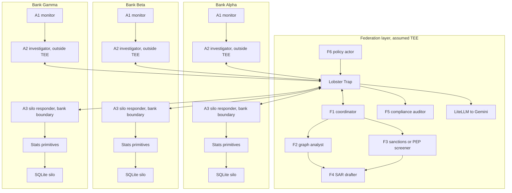

# federated_silo_agent

**Multi-agent cross-bank AML investigation system with privacy-preserving federation.**

Three synthetic banks each run a transaction-monitoring agent, an outside-TEE investigator agent, and an inside-bank silo responder agent. When suspicious activity surfaces at one bank, the investigator agent asks the federation coordinator to query peer banks. Peer-bank evidence is answered by each bank's silo responder inside that bank's trusted boundary, using deterministic stats primitives rather than exposing raw data to the investigator. When pooled statistical intermediaries need the requesting bank's own slice, F1 asks that bank's A3 through a separate local-contribution route, not a peer-bank Section 314(b) disclosure. Specialist federation agents coordinate graph analysis, sanctions or PEP screening, SAR drafting, and compliance audit. **Every cross-bank conversation is policed by Veea Lobster Trap plus an AML policy adapter. Banks share hash-based entity tokens rather than customer identities; aggregate-count queries are protected by differential privacy where it applies. No customer data crosses bank boundaries.**

Built for the [TechEx Intelligent Enterprise Solutions Hackathon](https://lablab.ai/ai-hackathons/techex-intelligent-enterprise-solutions-hackathon), May 11 to 19, 2026. Primary submission track: **Track 4, Data & Intelligence**. Partner-award strategy: **Gemini** powers the LLM agents through Google services; **Veea Lobster Trap** is the policy substrate. Pitch comp: **Verafin to Nasdaq, $2.75B in 2020** for the non-private version of this market.

> **Pivot note:** this project pivoted from clinical federated stats to cross-bank AML on May 12, 2026. The prior clinical work is preserved in [`docs/clinical-archive/`](docs/clinical-archive/) and [`data/scripts/clinical-archive/`](data/scripts/clinical-archive/). The active build is AML.

## What This Is

A multi-agent federated AML investigation platform:

1. **8 business agent roles, 14 business-agent instances, plus F6 policy actors.** Three A1 transaction-monitoring instances, three outside-TEE A2 investigator instances, three inside-bank A3 silo responder instances, and five federation roles: F1 coordinator, F2 graph analyst, F3 sanctions or PEP screener, F4 SAR drafter, and F5 compliance auditor. F6 is the signed per-domain Lobster Trap / AML policy actor, not a business-reasoning agent.
2. **Lobster Trap polices inter-agent messages.** The P0 policy already blocks prompt injection, jailbreaks, obfuscation, private-data extraction, data exfiltration, dangerous commands, and sensitive path access. The AML-specific policy pack comes later in P14.
3. **Privacy enforcement is layered.** Hash-based entity linkage is the primary cross-bank correlation mechanism. A2 has no raw database or stats-primitive handle. A3 invokes deterministic stats primitives inside each bank boundary. Schema validation limits what can leave a silo. Differential privacy applies to aggregate-count and histogram-style primitives where it provides useful protection.
4. **The demo UI is an inspection surface.** The planned judge console should show the state of signing, envelope verification, route approvals, replay protection, DP budget, LT verdicts, LiteLLM/provider health, and audit-chain integrity through read-only typed snapshots. These panels explain the trust machinery without granting extra privileges.

The demo scenario is a planted structuring ring spanning Bank Alpha, Bank Beta, and Bank Gamma. Each entity holds accounts at two banks. Per-bank activity stays noisy and sub-threshold; the pooled cross-bank pattern reveals the ring. One entity has a synthetic PEP relation for the sanctions agent to flag.

## Why It Matters

Section 314(b) of the USA PATRIOT Act allows financial institutions to share information about suspected money laundering and terrorist financing. In practice, banks underuse it because the operational and legal process is slow, inconsistent, and uncomfortable for competing institutions.

This project does not remove legal review. It lowers the technical friction:

- Common query primitives instead of ad hoc requests
- Hash-based cross-bank linkage instead of customer-name sharing
- Policy enforcement and audit logs for every cross-bank message
- Differential privacy budgets for repeated aggregate queries
- A reproducible multi-agent demo that shows why federation detects what a single bank misses

## Workflow

The core path is deliberately not a single headless model call:

```text
User or analyst
  -> A2 outside-TEE investigator
  -> Lobster Trap + AML policy adapter
  -> F1 federation coordinator in the assumed federation TEE
  -> Lobster Trap + AML policy adapter
  -> peer A3 silo responders inside each bank trusted boundary
  -> P7 stats primitives inside each bank boundary
  -> A3 signed/provenance-backed response
  -> F1 aggregation
  -> A2 synthesis back to the user
```

`A2` is human-facing and decides what to ask. `F1` validates, routes, aggregates, and audits. `A3` independently re-checks purpose, routing, allowed primitive shape, and DP budget before touching local data. The data returned to `A2` is bounded signal: booleans, counts, histograms, hash lists, refusal reasons, partial-refusal notes, and provenance records. Raw transactions and customer names do not return to `A2`.

## Current Build State

| Part | Status | Notes |
|---|---|---|
| P0 | Done | Repo scaffold, LiteLLM config, Lobster Trap build scripts, P0 smoke tests. Lobster Trap and blocked proxy ingress are verified. OpenRouter fallback pass-through is verified; direct Gemini pass-through still needs a valid Gemini key. |
| P1 | Done | Clinical work archived and AML plan established. |
| P2 | Done | Three synthetic bank databases generated with planted AML scenarios. |
| P3 | Done | Data validation and checksum tests pass. |
| P4 | Done | Shared Pydantic v2 message schemas for agent traffic. |
| P5 | Done | Agent runtime base class with deterministic bypasses, constraints, structured LLM parsing, and runtime audit events. |
| P6 | Done | A1 transaction-monitoring agent over local bank data. |
| P7 | Done | Bank-local stats primitives with DP accounting, OpenDP checks, provenance, and budget ledger snapshots. |
| P8 | Done | A2 outside-TEE investigator agent with typed query drafting, peer-response synthesis, and routing guardrails. |
| P8a | Done | A3 inside-bank silo responder plus the security-envelope foundation: canonical JSON, Ed25519 signatures, principal allowlist, replay cache, route approvals, local contributions, and P7 invocation checks. |
| P9 | Done | Deterministic F1 federation coordinator with signed A2 ingress validation, F1 route approvals, peer A3 routing, local-contribution routing, sanctions side requests, signed A3 response aggregation, and up to two bounded retries for negotiable silo refusals. |
| P9a | Done | FastAPI control API with typed state snapshots, system readiness, read-only component inspectors, and controlled adversarial probes for signing, allowlist, replay, route-approval, and DP-budget failures. |
| P9b | Done | Vite React judge console frame with five trust-domain swimlanes, typed OpenAPI client, component inspector drawer, interaction console, LLM route cards, system view, timeline filters, and attack lab over the P9a API. |
| P10 | Done | F3 sanctions/PEP screener over cross-bank hash tokens. It performs exact mock watchlist lookup and returns only boolean flags, never raw names, list sources, or notes. |
| P10a | Done | Short shared-contract pass for F4 SAR assembly, F5 audit review, and per-domain F6 policy/Lobster Trap evaluation before parallel implementation. |

See [`plan.md`](plan.md) for the full build plan.

The short-contract pass freezes the next shared interfaces before parallel work.
For F4, this includes `SARAssemblyRequest`, optional
`SARContribution.suspicious_amount_range`, and `SARContributionRequest`; for F5,
`AuditReviewRequest`/`AuditReviewResult`; and for each per-domain F6 policy
instance, `PolicyEvaluationRequest`/`PolicyEvaluationResult`. These are strict
Pydantic boundary models only; live F4, F5, F6, LT adapter, and orchestrator
behavior still land in later milestones.

## Data

The active AML data lives in [`data/silos/`](data/silos/) after generation:

| Bank | Customers | Accounts | Transactions | Signals | Ground-truth rows |
|---|---:|---:|---:|---:|---:|
| Bank Alpha | 8,009 | 14,043 | 112,212 | 1,969 | 9 |
| Bank Beta | 5,009 | 8,375 | 46,743 | 794 | 9 |
| Bank Gamma | 3,005 | 4,836 | 22,961 | 313 | 5 |

The planted scenarios include:

- S1: 5-entity structuring ring spanning all three banks
- S2: 3-entity structuring ring spanning Alpha and Beta
- S3: 4-entity layering chain across Alpha, Beta, Gamma, and back to Alpha
- S4: PEP marker on the S1-D entity

Regenerate and validate:

```powershell
uv run python data/scripts/build_banks.py
uv run python data/scripts/plant_scenarios.py
uv run python data/scripts/validate_banks.py
uv run pytest tests/test_data_checksum.py
```

## Architecture



The diagram is logical. The planned cloud demo should run the policy and model-egress stack per trust domain, not as one shared gateway. Each bank silo, investigator node, and federation node owns its local Lobster Trap, LiteLLM route, policy adapter, envelope signer/verifier, replay cache, and audit forwarder.

Five paths matter:

- **LLM path:** agent to local Lobster Trap to local LiteLLM to Gemini. OpenRouter can be used as a development fallback through the same LiteLLM boundary.
- **Coordinator path:** A2 sends approved cross-bank questions only to F1. F1 routes to peer A3 responders and aggregates responses back to A2.
- **Local contribution path:** when F1/F2 need the requesting bank's own statistical intermediaries, F1 asks that bank's A3 through `LocalSiloContributionRequest`. This is same-bank data-plane access, not a peer Section 314(b) disclosure.
- **Cross-bank response data path:** A3 to stats primitives to local SQLite. This is deterministic and bank-local. A2 has no raw database or P7 stats-primitive handle.
- **System-state path:** the UI reads typed snapshots from the control API for signing, envelope verification, replay, route approval, DP ledger, LT/LiteLLM health, and audit-chain status. It does not scrape logs and does not get write privileges over trust decisions.

## Privacy Model

| Mechanism | Role |
|---|---|
| Hash-based linkage | Lets banks correlate the same shell entity across institutions without exposing names. |
| Stats primitives | Restrict cross-bank data access to declared query shapes. |
| Schema validation | Blocks raw rows and undeclared shapes from leaving a bank. |
| Lobster Trap | Polices prompt injection, unsafe requests, role abuse, private data leakage, and cross-agent natural-language channels. |
| Differential privacy | Bounds repeated aggregate-query leakage for counts and histograms. |
| Audit stream | Records cross-bank messages, policy verdicts, primitive provenance, and privacy-budget debits. |
| System-state snapshots | Let the UI inspect signing, envelope, replay, route-approval, DP-ledger, provider-health, and audit-chain state without scraping logs or exposing secrets. |

DP is intentionally scoped. It is useful for aggregate counts and flow histograms. It is not the right tool for binary entity-presence queries, where noise would destroy the signal; those rely on hash linkage and audit controls. Flow histograms default to fixed-bucket `parallel_disjoint` accounting, where each transaction lands in exactly one bucket and the ledger pays the max bucket rho. The primitives also expose a conservative `serial` mode that splits the same ledger rho across buckets and records the selected mode in provenance.

Histogram provenance is display-sensitive. `rho_debited` and `eps_delta_display` describe the full released histogram. `per_bucket_rho` and `sigma_applied` describe the per-bucket Gaussian draw. In `serial` mode, the UI should show both the total release budget and the smaller per-bucket rho so auditors do not confuse release-level epsilon with bucket-level epsilon.

The UI-facing state panels are planned as observability only. They should report already-made decisions such as "signature verified", "nonce fresh", "rho remaining", or "route approval matched"; they must not become a second path for approving routes, changing budgets, or bypassing A3's silo-side checks.

The demo control API is split into two planes. The **observability plane** returns typed, redacted snapshots for node readiness, envelope verification, route approvals, replay state, DP ledger rows, provider health, primitive provenance, and audit state. The **probe plane** lets judges attack a node by submitting controlled adversarial inputs such as unsigned messages, body tampering, wrong-role senders, replayed nonces, route mismatches, prompt injection, unsupported query shapes, or budget exhaustion. Probe traffic must enter through the same signed-envelope, allowlist, replay, route-approval, Lobster Trap, A3, and P7 gates as ordinary traffic; the API must not expose privileged endpoints that directly mark a signature valid, approve a route, debit budget, or skip policy.

## Security Envelope

The design assumes a possible man-in-the-middle attacker on inter-agent network paths. Lobster Trap is necessary for content and policy governance, but it is not the cryptographic integrity layer.

Planned message-security controls:

- **mTLS service identity** between A2, F1, A3, Lobster Trap, LiteLLM, and supporting services.
- **Signed message envelopes** over canonical JSON for `Sec314bQuery`, `LocalSiloContributionRequest`, `Sec314bResponse`, SAR contributions, policy evaluations, audit reviews, and audit events. Hackathon scope uses Ed25519, not a production PKI.
- **Principal allowlist** that binds `agent_id`, role, bank id, `signing_key_id`, public key, allowed message types, allowed recipients, and allowed routes.
- **Request/response binding** through `message_id`, `query_id`, `in_reply_to`, route approval metadata, route kind, and a hash of the exact approved query body.
- **Replay protection** through timestamp, expiration, nonce, and an idempotency cache.
- **Silo-side re-validation** where A3 treats F1 approval as necessary but not sufficient. A3 still checks verified principal, route kind, purpose, target bank, query shape, primitive allowlist, and DP budget.
- **Audit hash chain** so deleted or modified audit events are detectable.
- **TEE attestation hook** for deployments that claim the federation layer or silo responder is running inside a specific trusted execution environment.

The practical rule is: F1 may approve and route, but each silo remains sovereign over whether it can answer. Peer disclosure uses `route_kind="peer_314b"`. Same-bank pooled intermediaries use `route_kind="local_contribution"` and are not modeled as peer targets. A3 can return a refusal such as `unsupported_query_shape`, `unsupported_metric`, `unsupported_metric_combination`, `invalid_rho`, `route_violation`, `signature_invalid`, `principal_not_allowed`, `envelope_invalid`, `replay_detected`, `budget_exhausted`, or `provenance_violation`. If F1 retries with lower rho or a supported fallback metric, the response is a negotiated fallback and the retry note must be shown as such.

DP-backed aggregate metrics require an explicit positive `requested_rho_per_primitive`. A3 refuses zero-rho aggregate requests rather than silently substituting defaults, accepts one aggregate metric class per request, refuses mixed aggregate metric requests before any DP primitive runs, and refuses multi-hash `alert_count` fan-out until a batched primitive exists.

Trust model note: A3 verifies F1's signed envelope and F1's signed `RouteApproval`; it does not independently re-verify the original A2 signature. F1 is responsible for authenticating A2 on ingress and transitively vouching for the request when it routes to A3.

For the judge console, the security-envelope layer should expose redacted state such as `signing_key_id`, canonical body hash, signature verification status, nonce freshness, replay-cache hit or miss, route kind, route-approval binding status, and audit-chain head. It must never expose private signing keys, API keys, raw customer names, or raw account identifiers.

## P0 Proxy Chain

P0 proves the governance path:

```text
agent or smoke script
  -> Lobster Trap on http://127.0.0.1:8080
  -> LiteLLM on http://127.0.0.1:4000
  -> Gemini API
```

Local policy smoke, no Gemini key required:

```powershell
.\scripts\bootstrap_lobstertrap.ps1
uv run python scripts/smoke_lobstertrap.py
```

Full proxy smoke, Gemini key required:

```powershell
$env:GEMINI_API_KEY = "<your key>"
.\scripts\start_litellm.ps1
.\scripts\start_lobstertrap.ps1
uv run python scripts/smoke_proxy.py
```

## Run The Judge Console

Start the P9a API in one terminal:

```powershell
uv run uvicorn backend.ui.server:app --reload --port 8000
```

Start the P9b frontend in a second terminal:

```powershell
.\scripts\start_frontend.ps1
```

Open `http://127.0.0.1:5173/#/console`. The console reads the P9a typed API, shows all five trust-domain stacks, and keeps not-built components visible with milestone placeholders.

OpenRouter fallback smoke, OpenRouter key required:

```powershell
$env:OPENROUTER_API_KEY = "<your key>"
.\scripts\start_litellm.ps1 -OpenRouter
.\scripts\start_lobstertrap.ps1
uv run python scripts/smoke_openrouter.py
```

OpenRouter can be used as a development fallback through LiteLLM, but the primary hackathon story should stay direct Gemini via Google AI Studio or Gemini API.

More detail lives in [`docs/p0_proxy_chain.md`](docs/p0_proxy_chain.md).

## Project Structure

```text
federated_silo_agent/
  data/
    silos/                         generated bank SQLite databases
    scripts/
      build_banks.py               baseline synthetic bank generation
      plant_scenarios.py           planted AML rings and layering chain
      validate_banks.py            scenario and data validation
      clinical-archive/            prior clinical pipeline
  docs/
    p0_proxy_chain.md              local P0 runbook
    clinical-archive/              prior clinical plan
  infra/
    litellm_config.yaml            Gemini routing through LiteLLM
    litellm_openrouter_config.yaml OpenRouter fallback routing through LiteLLM
    docker-compose.yml             optional LiteLLM plus Lobster Trap stack
    lobstertrap/
      base_policy.yaml             current P0 policy
      Dockerfile                   optional container build
  scripts/
    bootstrap_lobstertrap.ps1      clone, test, and build Lobster Trap
    start_litellm.ps1              native Windows LiteLLM launcher
    start_lobstertrap.ps1          native Windows Lobster Trap launcher
    smoke_lobstertrap.py           local policy smoke
    smoke_proxy.py                 live proxy-chain smoke
    smoke_openrouter.py            OpenRouter-backed proxy-chain smoke
    p0_cases.py                    shared P0 prompt cases
  backend/
    agents/                        A1, A2, A3, and planned F-agent implementations
    silos/                         bank-local stats primitives, DP, and budget ledger
    security/                      P8a signing, allowlist, canonical JSON, and replay helpers
  shared/
    enums.py                        shared enum values
    messages.py                     Pydantic v2 message contracts
  tests/
    test_agent_base.py
    test_a1.py
    test_a2.py
    test_budget.py
    test_data_checksum.py
    test_dp_composition.py
    test_messages.py
    test_p0_cases.py
    test_stats_primitives.py
  plan.md
  README.md
```

## Setup

Python:

```powershell
uv sync
uv run pytest
```

Gemini:

```powershell
# Create .env manually or set the variable in your shell.
$env:GEMINI_API_KEY = "<your key>"
```

The current shell can also use `OPENROUTER_API_KEY` if the LiteLLM config is switched to the OpenRouter fallback route.

## Verification

Known-good checks:

```powershell
uv run python data/scripts/validate_banks.py
uv run pytest
uv run pytest tests/test_messages.py
uv run python scripts/smoke_lobstertrap.py
```

The live benign Gemini proxy check is intentionally separate because it spends provider quota and requires an API key.

## Acknowledgments

- [Veea Lobster Trap](https://github.com/veeainc/lobstertrap), the policy proxy for LLM-channel governance.
- [Google Gemini](https://ai.google.dev/), the target LLM provider for the hackathon build.
- [LiteLLM](https://github.com/BerriAI/litellm), the OpenAI-compatible routing layer.
- [OpenDP](https://github.com/opendp/opendp), used for differential privacy checks around the stats primitives.
- [Synthea](https://synthetichealth.github.io/synthea/), used in the archived clinical prototype.

## License

TBD, likely MIT to match the open-source stack.
